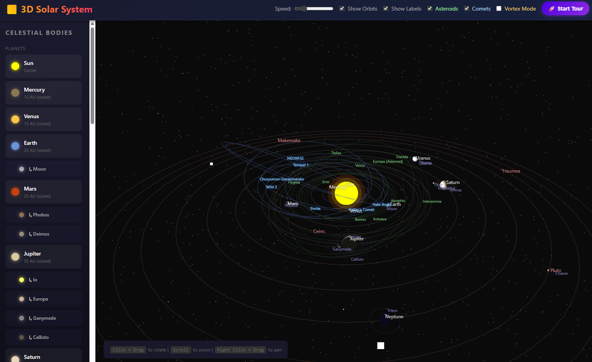

# 🌌 3D Solar System Simulator

An interactive 3D visualization of our Solar System built with Three.js. Explore planets, moons, dwarf planets, asteroids, and comets in stunning 3D.



## ✨ Features

### Celestial Bodies
- **The Sun** - Our star at the center with realistic glow effects
- **8 Planets** - Mercury, Venus, Earth, Mars, Jupiter, Saturn, Uranus, Neptune
- **5 Dwarf Planets** - Ceres, Pluto, Haumea, Makemake, Eris
- **10 Named Asteroids** - Including Vesta, Bennu, Apophis, and more
- **7 Famous Comets** - Halley's Comet, Hale-Bopp, NEOWISE, and others
- **Moons** - Major moons for each planet including Earth's Moon, Jupiter's Galilean moons, Saturn's Titan, and more

### Interactive Controls
- 🖱️ **Click + Drag** - Rotate the view
- 🔍 **Scroll** - Zoom in/out
- 👆 **Right Click + Drag** - Pan the view
- 📋 **Sidebar** - Click any object to focus on it

### Display Options
- **Speed Control** - Adjust orbital animation speed
- **Toggle Orbits** - Show/hide orbital paths
- **Toggle Labels** - Show/hide object names
- **Asteroids Toggle** - Show/hide asteroids
- **Comets Toggle** - Show/hide comets
- **Vortex Mode** - Visualize the solar system as a cone traveling through space

### Guided Tour
- 🚀 **Start Tour** - Automatically zooms through all celestial bodies
- Smooth camera transitions between objects
- Progress indicator showing current object

### Information Panel
- Detailed information for each celestial body
- Physical properties (mass, diameter, temperature)
- Orbital characteristics
- Quick facts and discovery information
- Direct links to Wikipedia for more details

## 🛠️ Technologies

- **Three.js** - 3D graphics library
- **WebGL** - Hardware-accelerated rendering
- **HTML5/CSS3** - Modern web standards
- **JavaScript ES6+** - Interactive functionality

## 🚀 Getting Started

1. Clone or download this repository
2. Open `index.html` in a modern web browser
3. No build process or dependencies required!

```bash
# Simply open in browser
open index.html
```

## 🎮 Usage Tips

- **Focus on an object** - Click its name in the sidebar
- **Free camera** - Click and drag anywhere to break free from following an object
- **Vortex Mode** - Toggle to see the solar system as it moves through the galaxy
- **Tour Mode** - Sit back and enjoy an automated tour of the solar system

## 📊 Data Sources

Astronomical data is based on NASA and ESA publications. Distances and sizes are scaled for visualization purposes.

## 🌐 Browser Support

- Chrome (recommended)
- Firefox
- Safari
- Edge

Requires WebGL support.

## 📝 License

This project is open source and available for educational purposes.

---
